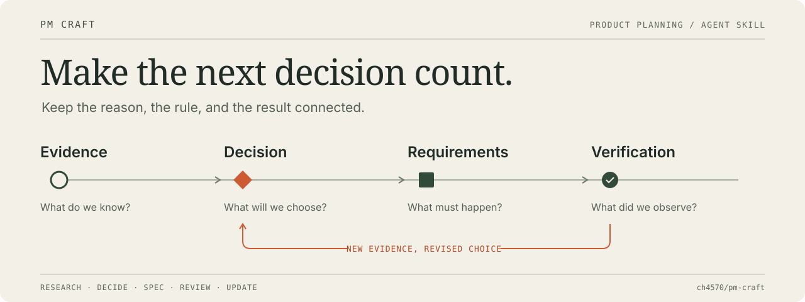

# PM Craft

**Make a product decision. Carry it through to the next person building it.**

[한국어](README.ko.md) · [v0.1.0](https://github.com/ch4570/pm-craft/releases/tag/v0.1.0) · [Install](INSTALL.md) · [Examples](examples/README.md) · [Evaluation](evals/README.md)

PM Craft is an agent skill for planning apps and services. It helps you research a problem, choose an MVP, write a product spec, review an existing plan, and keep related requirements consistent when a decision changes.

It keeps customer evidence separate from assumptions, makes product rules concrete, and distinguishes a proposed check from a result someone actually observed. Use your existing PRD; a small request does not need a new document system.

**One skill · Five focused modes · English and Korean guides · MIT**

## Start with your next decision

Clone the pinned release and install the skill in your project. Requires Git and Python 3.11+; a [release ZIP and manual copy](INSTALL.md) are also available.

```sh
git clone --branch v0.1.0 https://github.com/ch4570/pm-craft.git
cd pm-craft
python3 install.py --repo /absolute/path/to/your-project
```

Then ask your agent:

```text
$pm-craft Review our PRD's group voting rules. Explain who can change
a vote, when a decision becomes final, and what happens to missing
responses. Propose only the missing decisions; keep the review read-only.
```

If your host does not support `$pm-craft`, ask it to read `.agents/skills/pm-craft/SKILL.md` and follow it for the task. Host discovery and tool availability vary. [Installation and troubleshooting](INSTALL.md).

PM Craft contains instructions and references. Your agent supplies the model, file access, and any research tools; their normal usage costs and permissions apply. The installer copies the skill. It does not run a PM model or provide a planning CLI, API, or external account connection.

## Choose the work you need

| Your request | Mode | Useful result |
| --- | --- | --- |
| “What evidence would justify building this?” | Research | Sources, open assumptions, and a proportionate test |
| “What can we cut for a two-week pilot?” | Decide | A complete first use case, trade-offs, and deferred scope |
| “Make these rules ready for development.” | Spec | Actors, conditions, state changes, and acceptance scenarios |
| “Find gaps in this plan.” | Review | Specific findings with evidence and proposed corrections |
| “We changed the price and added sharing.” | Update | Affected requirements, permissions, metrics, and retained history |

These are alternatives, not five mandatory steps. A narrow review stays narrow. An existing decision stays in force until the user changes it or adopts a proposed replacement.

## See what it produces

The [examples](examples/README.md) use fictional product situations to show how evidence, decisions, requirements, and checks fit together. They are not customer validation results.

The [evaluation guide](evals/README.md) defines realistic tasks and comparison conditions. We have not established that PM Craft outperforms a baseline model or another PM skill library. [Validation](VALIDATION.md) records checks actually run and their limits; package checks alone do not establish planning quality.

| Guide | What you will find |
| --- | --- |
| [Usage](docs/usage.md) · [한국어 사용법](docs/usage.ko.md) | Prompts, inputs, outputs, and handoffs |
| [Install](INSTALL.md) | Project installation, custom paths, updates, and removal |
| [Design](docs/design.md) | Scope, modes, and evidence boundaries |
| [Comparison](docs/comparison.md) | Design choices and the pinned upstream material we reviewed |
| [Contributing](CONTRIBUTING.md) | Develop and test a change |

[Support](SUPPORT.md) · [Changelog](CHANGELOG.md) · [MIT license](LICENSE)
